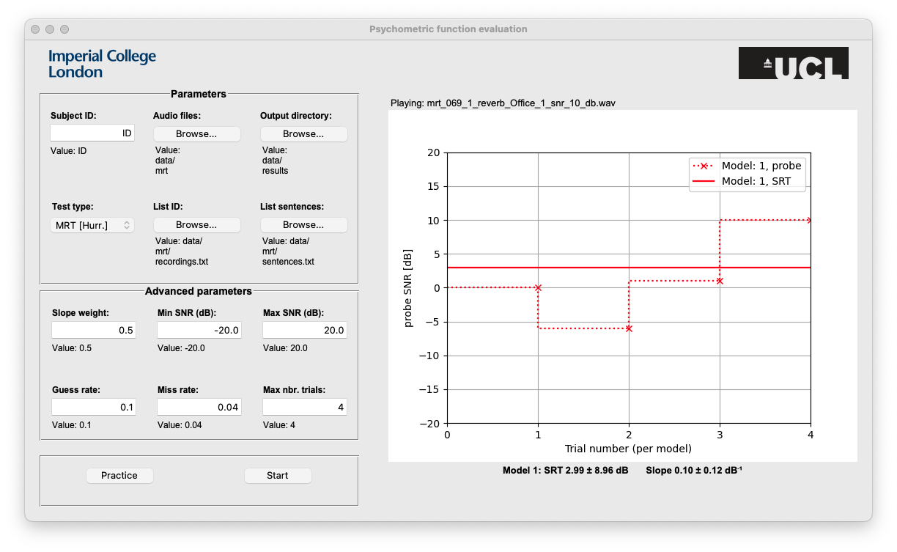
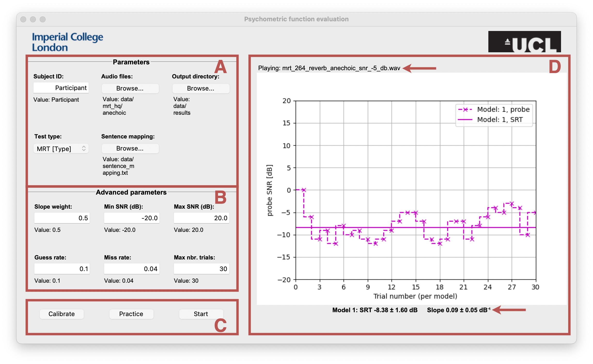

# PyBasie - Psychometric Function Evaluation Using Basie in Python
**PyBasie** is an intuitive Python-based GUI for evaluating Speech Reception Thresholds (SRTs) in (reverberant) speech-in-noise conditions. It employs a **Bayesian adaptive approach** for precise psychometric function estimation, following the methodology in [[1]](https://pubs.aip.org/asa/jasa/article/141/4/2501/1059157). Key features include:  
- **Customizable experiment parameters**: Define test settings, input/output directories, and subject-specific data.  
- **Dynamic SRT estimation**: Handles multiple reverberation conditions and generates individual SRT models.  
- **Real-time feedback**: Visualize SRT estimates and trial progress during experiments.  
- **Cross-validation with MATLAB**: Validate Python implementation against MATLAB's Voicebox framework.  

<p align="center">
  
</p>
<p align="center"><i>Figure 1: Preview of the GUI used for SRT estimation.</i></p>


## Requirements
- **Python** (Download [here](https://www.python.org/downloads)).  
- **Git** (Download [here](https://git-scm.com/download/win)).  
- **[Optional] MATLAB** for reproducing experiments in [to come].  

## Installation
1. Clone the repository:
   ```bash
   git clone https://github.com/ed1016/pybasie.git
   ```
2. Install dependencies: 
   ```bash
   cd pybasie
   pip install -r requirements.txt
   ```
3. Launch the GUI:
   ```bash
   python psycest_gui.py
   ```
## Usage and Experiment Reproduction
- A minimum working example is provided in the `exampledata` folder to trial the GUI and estimation procedure.
- To reproduce the experimental setup in [to come], MATLAB scripts in the utils folder can be used:
  - `create_babble.m`: Generates babble noise.
  - `generate_data.m`: Creates reverberant speech-in-noise files.
  - `sentence_mapping.txt`: Maps audio files to spoken sentences.
   
## Detailed Features
<p float="none" align="middle">
  
</p>

> **Figure 2**: GUI used for SRT estimation where (A) shows the experiment parameters panel, (B) indicates where the Basie parameters for SRT estimation can be adjusted, (C) are the start/stop buttons, and (D) is the control panel showing progress with trials.  

### Parameters panel (A)
Set up experiment-specific parameters:
- **Subject ID**: participant's name.
- **Audio files**: path to the _folder_ containing the audio to use in the experiment.

  > **Note**: Audio file naming must follow the convention `[filename]_reverb_[reverb]_snr_[snr]_dB.wav`, e.g. `mrt_001_reverb_anechoic_snr_-1_dB.wav`. Multiple reverberation conditions in the folder result in joint SRT model estimations.

- **Ouput directory**: path to the _folder_ used to save results.
- **Test type**: type of test and feedback used. The current implementation contains the MRT sentences [[2]](https://pubs.aip.org/asa/jasa/article/35/11_Supplement/1899/617588)[[3]](https://datashare.ed.ac.uk/handle/10283/347) with the option to type the participant's answer, or select an option out of five.
- **Sentence mapping**: path to the _file_ containing the audio file-to-word mapping used in the experiment (e.g. `mrt_001.wav` is the word `went`).

***

### Basie advanced parameters (B)
Customize Bayesian adaptive parameters:
- **Slope weight**: prioritization of slope vs. SRT estimation.
- **Min/Max SNR (dB)**: range of signal-to-noise ratios available in the audio files.
- **Guess rate**: probability of guessing the correct word without hearing it.
- **Miss rate**: probability of incorrect responses despite hearing the word.
- **Max. nbr. trials**: number of trials after which the experiment stops.

***

### Start/stop panel (C)
Initiate and manage experiment phases:
- **Calibrate**: play back noiseless and loudest samples to set comfortable listening levels.

  > **Note**: `clearspeech.wav` and `maxloudness.wav` files must be placed in the parent folder to the **Audio files** folder.

- **Practice**: start practice phase.

  > **Note**: Practice files follow the same naming convention as audio files, preceedeed by `practice_`, e.g. `practice_mrt_001_reverb_anechoic_snr_-1_dB.wav`.
- **Start**: begin the experiment.

***

### Right panel (D)
Displays real-time updates during experiments:
- In each trial, the name of the audio file being played is printed at the top of the panel.
- Each probe SNR is progressively plotted using a dashed line and crosses. The value of the SRT estimate at each step is plotted as an horizontal line.
- The exact values of the SRT and slope estimates are given at the bottom of the panel, along with the associated estimated variances.
- While the experiment is running, a **Pause** button is available at the bottom of the panel. The experiment can be paused and restarted for the same **Subject ID** in the same day.

## Validating PyBasie implementation
A script is provided to validate the Python implementation of Basie compared to the MATLAB implementation in [Voicebox](http://www.ee.ic.ac.uk/hp/staff/dmb/voicebox/mdoc/v_mfiles/v_psycest.html).

You can run the evaluation script for a specified `eval/config.yml` configuration using
```bash
cd eval
./validate.sh config.yml
```
The script provides a statistical evaluation of both Python and Matlab implementations. The number of realisations can be changed in the `config.yml` file. Results for 1000 realisations are provided in the `eval/results` folder.


## Citing
Please cite this work using
```
@article{Doire2017,
title={Robust and efficient Bayesian adaptive psychometric function estimation},
author={Doire, Clement SJ and Brookes, Mike and Naylor, Patrick A},
journal={The Journal of the Acoustical Society of America},
volume={141},
number={4},
pages={2501--2512},
year={2017}
}
```


## References
[1]&nbsp; Doire, C.S., Brookes, M. and Naylor, P.A., 2017. [Robust and efficient Bayesian adaptive psychometric function estimation](https://pubs.aip.org/asa/jasa/article/141/4/2501/1059157). The Journal of the Acoustical Society of America, 141(4), pp.2501-2512.<br>
[2]&nbsp; House, A.S., Williams, C., Hecker, M.H. and Kryter, K.D., 1963. [Psychoacoustic speech tests: A modified rhyme test](https://pubs.aip.org/asa/jasa/article/35/11_Supplement/1899/617588). The Journal of the Acoustical Society of America, 35(11_Supplement), pp.1899-1899.<br>
[3]&nbsp; Cooke, M., Valentini-Botinhao, C. and Mayo, C., 2019. [Hurricane natural speech corpus-higher quality version](https://datashare.ed.ac.uk/handle/10283/347).

