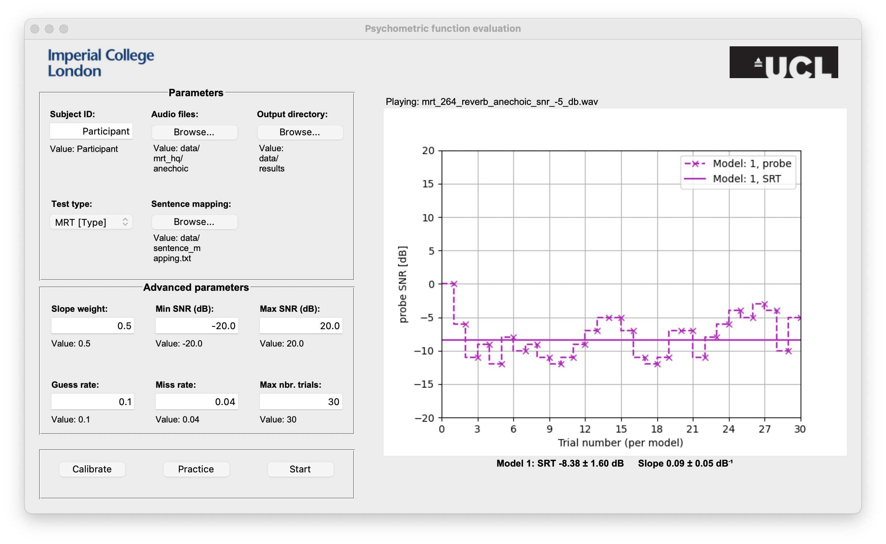

# PyBayesi - Psychometric function evaluation using Bayesi in Python
## Installation
This software requires a working version of python. Download [here](https://www.python.org/downloads).

You also need to have [git installed](https://git-scm.com/download/win) on your computer. 

Open `Git Bash` and follow these steps to launch the GUI.

Clone this repository
```git
git clone https://github.com/ed1016/py_bayesi.git
```
Install python dependencies
```bash
pip install -r requirements.txt
```
Launch the GUI using
```bash
cd py_bayesi
python psycest_gui.py
```
<!-- ## Code and usage -->

## General User Interface (GUI)


## The Modified rhyme test (MRT)
[Original paper describing the sentences](https://pubs.aip.org/asa/jasa/article/35/11_Supplement/1899/617588), recorded by British-English speaker [here](https://datashare.ed.ac.uk/handle/10283/347).

The test contains 50 ensembles of 6 phonetically related words, e.g.
```
must	bust	gust	rust	dust	just
```

Each sentence has the format `Now we will say [word] again`.

<!-- 
The user is asked to listen to the sentence and choose between the 6 words, or a 'Don't know' option.

 -->

